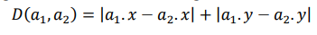
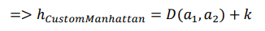
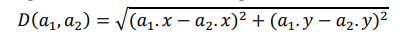
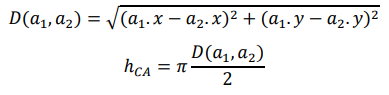

<div id="top"></div>
<!--
*** Thanks for checking out the Best-README-Template. If you have a suggestion
*** that would make this better, please fork the repo and create a pull request
*** or simply open an issue with the tag "enhancement".
*** Don't forget to give the project a star!
*** Thanks again! Now go create something AMAZING! :D
-->


<!-- PROJECT SHIELDS -->
<!--
*** I'm using markdown "reference style" links for readability.
*** Reference links are enclosed in brackets [ ] instead of parentheses ( ).
*** See the bottom of this document for the declaration of the reference variables
*** for contributors-url, forks-url, etc. This is an optional, concise syntax you may use.
*** https://www.markdownguide.org/basic-syntax/#reference-style-links
-->

[comment]: <> ([![Contributors][contributors-shield]][contributors-url])

[comment]: <> ([![Forks][forks-shield]][forks-url])

[comment]: <> ([![Stargazers][stars-shield]][stars-url])

[comment]: <> ([![Issues][issues-shield]][issues-url])

[comment]: <> ([![MIT License][license-shield]][license-url])

[comment]: <> ([![LinkedIn][linkedin-shield]][linkedin-url])


<!-- PROJECT LOGO -->
<br />
<div align="center">
  <a href="https://github.com/namworkmc/Project-A-star-Path-Finding">
    
  </a>

  <h3 align="center">AI Project | A* Path Finding</h3>

  <p align="center">
    Đồ án tìm đường đi tối ưu bằng thuật toán A*
    <br />
    <a href="https://github.com/namworkmc/Project-A-star-Path-Finding/tree/main/Report"><strong>Báo cáo tìm hiểu chủ đề tìm đường đi tối ưu »</strong></a>
    <br />
    <br />
  </p>
</div>


<!-- TABLE OF CONTENTS -->
<details>
  <summary>Table of Contents</summary>
  <ol>
    <li>
      <a href="#about-the-project">About The Project</a>
      <ul>
        <li><a href="#built-with">Built With</a></li>
      </ul>
    </li>
    <li>
      <a href="#getting-started">Getting Started</a>
      <ul>
        <li><a href="#prerequisites">Prerequisites</a></li>
        <li><a href="#installation">Installation</a></li>
      </ul>
    </li>
    <li><a href="#usage">Usage</a></li>
    <li><a href="#roadmap">Roadmap</a></li>
    <li><a href="#contributing">Contributing</a></li>
    <li><a href="#license">License</a></li>
    <li><a href="#contact">Contact</a></li>
    <li><a href="#acknowledgments">Acknowledgments</a></li>
  </ol>
</details>


<!-- ABOUT THE PROJECT -->
## Mô tả

[![Product Name Screen Shot][product-screenshot]](https://example.com)

Khác với các thuật toán **uninformed search** như BFS hay DFS đi tới đâu mới tìm đường tới đó,
A* là một thuật toán **informed search**, trong quá trình tìm đường đi nếu gặp các ngã rẽ, thuật toán sẽ cân nhắc chọn ngã rẽ
dẫn tới đích tối ưu nhất dựa vào hàm Heuristic.

Trong Project, chúng tôi sử dụng thuật toán A* để tìm đường đi từ toạ độ A (x, y) đến toạ độ B (x, y) của bản đồ dưới dạng Bitmap.
Mỗi pixel của hình tương ứng với một toạ độ (x, y). Độ cao của bản đồ phụ thuộc vào màu của pixel, màu đen là thấp nhất và máu trắng là cao nhất.


### Built With

Được viết bằng Python 3.7.8 64-bit, sử dụng các thư viện sau:

* [NumPy](https://numpy.org/)
* [SymPy](https://www.sympy.org/)
* [Pillow](https://pillow.readthedocs.io/en/stable/)

<!-- GETTING STARTED -->
## Getting Started

Đầu tiên cần phải cài Python để sử dụng được Source. Để cài Python vui lòng truy cập [trang chính thông](https://www.python.org/downloads/) của để tải về. 

### Prerequisites

* pip
  ```sh
  NumPy: pip install numpy
  SymPy: pip install sympy
  Pillow: pip install pillow
  ```

### Installation

1. Clone the repo
   ```sh
   git clone https://github.com/namworkmc/Project-A-star-Path-Finding.git
   ```
2. Cài các Python package
   ```sh
   NumPy: pip install numpy
   SymPy: pip install sympy
   Pillow: pip install pillow
   ```
3. Sử dụng Visual Studio Code chạy file Main.py để chạy Source

<!-- USAGE EXAMPLES -->
## Usage
1. Python version <br />

2. Chạy code <br />

3. Chọn hàm Heuristic cho thuật toán <br />

   


<!-- IDEA -->
## Ý tưởng của thuật toán và 3 hàm Heuristic tự sáng tạo

### Ý tưởng thuật toán
**_open_list_** là một Priority Queue (**_PQ_**) để lưu lại các toạ độ (node) đã đi qua và dùng để mở rộng (expand)
đường đi (các node chưa duyệt). Sử dụng giá trị Priority: f(n) = g(n) + h(n) (trị số **_P_**).

**_G_Score_** là một ma trận có kích thước với với ảnh đầu vào, giá trị khởi tạo của từng phần tử của ma
trận là **infinity** (đại diện cho node chưa duyệt qua), dùng để lưu giá trị g(n) của từng toạ độ.

**_Path_** là tập đường đi.

**_Thuật toán:_**<br>
Khởi tạo **_open_list_**, **_G_Score_**, **_Path_**

Khởi tạo vị trí bắt đầu (**start**) và cho vào **_G_Score_** với giá trị là **0**. Thêm **start** vào **_open_list_**
với trị số **_P_**. Bước tiếp theo, lấy phần tử có trị số **_P_** nhỏ nhất ra khỏi **_PQ_** gọi là current, 
so sánh với vị trí kết thúc (**goal**), nếu trùng khớp kết thúc thuật toán. 
Ngược lại, tạo list **_successor_** lưu lại toạ độ các điểm lân cận có thể đi qua.
Duyệt từng phần của tập **_successor_**, kiểm tra **cost** của **_successor_** bằng cách lấy g(n) của current
cộng với khoảng cách giữa **_successor_** đang xét và currentl. Nếu **cost** thấp hơn g(n) của **_successor_**, cập
nhật lại g(n) của **_successor_** = **cost**, tính h(n) theo công thức Heuristic đề xuất, thêm **_successor_** vào
**_open_list_** với trị số **_P_** = g(n) + h(n) của **_successor_**. Thực hiện lại các bước cho đến khi **_open_list_** rỗng.

### Ý tưởng của 3 hàm Heuristic
1. CustomManhattan
Dựa trên ý tưởng khoảng cách Manhattan, công thức: <br>
   <br>
Nhóm đã cộng thêm một tham số 𝑘 = |𝑚 − 𝐷(𝑎1, 𝑎2)| (trong đó m là hằng số để kiểm tra độ chênh lệch độ cao),
sau đó cho 𝑘 = 𝑘 + 1 đến khi 𝑘 là một số nguyên tố. Sau đó ta có được hàm Heuristic:<br>
<br>
   
2. CustomEuclid
Tương tự như CustomManhattan, nhóm cũng dựa trên ý tưởng khoảng cách Euclid với công thức:<br>
<br>
Nhóm đã cộng thêm một tham số 𝑘 = |𝑚 − 𝐷(𝑎1, 𝑎2)| (trong đó m là hằng số để kiểm tra độ chênh lệch độ cao),
sau đó cho 𝑘 = 𝑘 + 1 đến khi 𝑘 là một số nguyên tố. Sau đó ta có được hàm Heuristic:<br>


3. Circle Area
Thuật toán A* khi expand node về phía goal theo hình Elip nên ý tưởng diện
tích hình Elip làm hàm heuristic. Tuy nhiên để tính diện tích hình Elip sẽ khá phức
tạp thay vào đó nhóm sử dụng công thức tính diện tích tương đối giống với Elip là hình tròn:<br>


<!-- CONTACT -->
## Contact

Nguyễn Đức Nam - [@Facebook](https://www.facebook.com/DucNamHCMUS) - namworkmc@gmail.com<br>
Lê Ngọc Minh Nhật - [@Facebook](https://www.facebook.com/profile.php?id=100050103259038) - 19127@gmail.com

Project Link: [https://github.com/namworkmc/Project-A-star-Path-Finding](https://github.com/namworkmc/Project-A-star-Path-Finding)

<p align="right">(<a href="#top">back to top</a>)</p>


<!-- MARKDOWN LINKS & IMAGES -->
<!-- https://www.markdownguide.org/basic-syntax/#reference-style-links -->
[contributors-shield]: https://img.shields.io/github/contributors/othneildrew/Best-README-Template.svg?style=for-the-badge
[contributors-url]: https://github.com/othneildrew/Best-README-Template/graphs/contributors
[forks-shield]: https://img.shields.io/github/forks/othneildrew/Best-README-Template.svg?style=for-the-badge
[forks-url]: https://github.com/othneildrew/Best-README-Template/network/members
[stars-shield]: https://img.shields.io/github/stars/othneildrew/Best-README-Template.svg?style=for-the-badge
[stars-url]: https://github.com/othneildrew/Best-README-Template/stargazers
[issues-shield]: https://img.shields.io/github/issues/othneildrew/Best-README-Template.svg?style=for-the-badge
[issues-url]: https://github.com/othneildrew/Best-README-Template/issues
[license-shield]: https://img.shields.io/github/license/othneildrew/Best-README-Template.svg?style=for-the-badge
[license-url]: https://github.com/othneildrew/Best-README-Template/blob/master/LICENSE.txt
[linkedin-shield]: https://img.shields.io/badge/-LinkedIn-black.svg?style=for-the-badge&logo=linkedin&colorB=555
[linkedin-url]: https://linkedin.com/in/othneildrew
[product-screenshot]: images/screenshot.png
