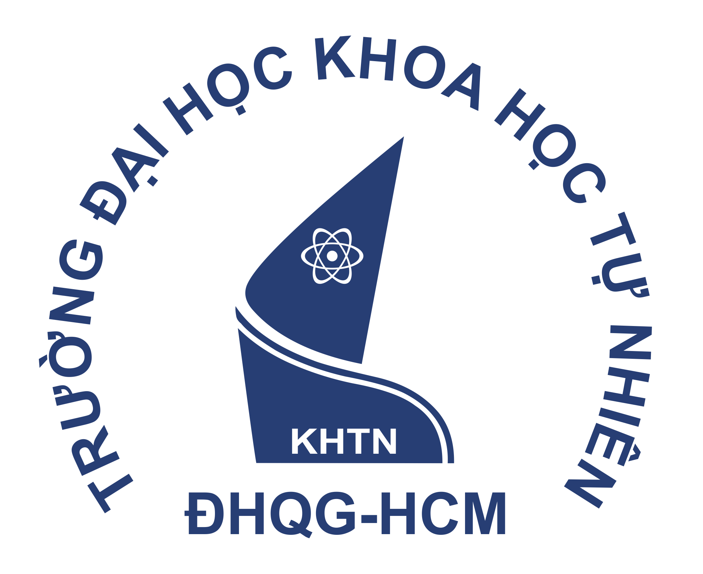
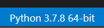
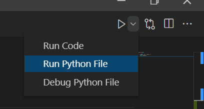
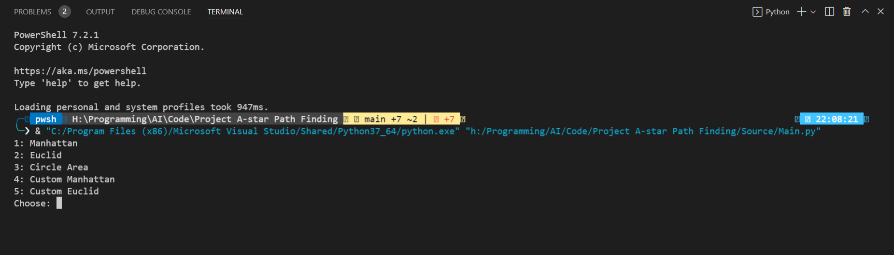

<div id="top"></div>
<!--
*** Thanks for checking out the Best-README-Template. If you have a suggestion
*** that would make this better, please fork the repo and create a pull request
*** or simply open an issue with the tag "enhancement".
*** Don't forget to give the project a star!
*** Thanks again! Now go create something AMAZING! :D
-->


<!-- PROJECT SHIELDS -->
<!--
*** I'm using markdown "reference style" links for readability.
*** Reference links are enclosed in brackets [ ] instead of parentheses ( ).
*** See the bottom of this document for the declaration of the reference variables
*** for contributors-url, forks-url, etc. This is an optional, concise syntax you may use.
*** https://www.markdownguide.org/basic-syntax/#reference-style-links
-->

[comment]: <> ([![Contributors][contributors-shield]][contributors-url])

[comment]: <> ([![Forks][forks-shield]][forks-url])

[comment]: <> ([![Stargazers][stars-shield]][stars-url])

[comment]: <> ([![Issues][issues-shield]][issues-url])

[comment]: <> ([![MIT License][license-shield]][license-url])

[comment]: <> ([![LinkedIn][linkedin-shield]][linkedin-url])


<!-- PROJECT LOGO -->
<br />
<div align="center">
  <a href="https://github.com/namworkmc/Project-A-star-Path-Finding">
    
  </a>

  <h3 align="center">AI Project | A* Path Finding</h3>

  <p align="center">
    Đồ án tìm đường đi tối ưu bằng thuật toán A*
    <br />
    <a href="https://github.com/namworkmc/Project-A-star-Path-Finding/tree/main/Report"><strong>Báo cáo tìm hiểu chủ đề tìm đường đi tối ưu »</strong></a>
    <br />
    <br />
  </p>
</div>


<!-- TABLE OF CONTENTS -->
<details>
  <summary>Table of Contents</summary>
  <ol>
    <li>
      <a href="#about-the-project">About The Project</a>
      <ul>
        <li><a href="#built-with">Built With</a></li>
      </ul>
    </li>
    <li>
      <a href="#getting-started">Getting Started</a>
      <ul>
        <li><a href="#prerequisites">Prerequisites</a></li>
        <li><a href="#installation">Installation</a></li>
      </ul>
    </li>
    <li><a href="#usage">Usage</a></li>
    <li><a href="#roadmap">Roadmap</a></li>
    <li><a href="#contributing">Contributing</a></li>
    <li><a href="#license">License</a></li>
    <li><a href="#contact">Contact</a></li>
    <li><a href="#acknowledgments">Acknowledgments</a></li>
  </ol>
</details>


<!-- ABOUT THE PROJECT -->
## Mô tả

[![Product Name Screen Shot][product-screenshot]](https://example.com)

Khác với các thuật toán **uninformed search** như BFS hay DFS đi tới đâu mới tìm đường tới đó,
A* là một thuật toán **informed search**, trong quá trình tìm đường đi nếu gặp các ngã rẽ, thuật toán sẽ cân nhắc chọn ngã rẽ
dẫn tới đích tối ưu nhất dựa vào hàm Heuristic.

Trong Project, chúng tôi sử dụng thuật toán A* để tìm đường đi từ toạ độ A (x, y) đến toạ độ B (x, y) của bản đồ dưới dạng Bitmap.
Mỗi pixel của hình tương ứng với một toạ độ (x, y). Độ cao của bản đồ phụ thuộc vào màu của pixel, màu đen là thấp nhất và máu trắng là cao nhất.


### Được viết bằng

Được viết bằng Python 3.7.8 64-bit, sử dụng các thư viện sau:

* [NumPy](https://numpy.org/)
* [SymPy](https://www.sympy.org/)
* [Pillow](https://pillow.readthedocs.io/en/stable/)

<!-- GETTING STARTED -->
## Bắt đầu

Đầu tiên cần phải cài Python để sử dụng được Source. Để cài Python vui lòng truy cập [trang chính thông](https://www.python.org/downloads/) của để tải về. 

### Cài đặt các thư viện cần thiết

* pip
  ```sh
  NumPy: pip install numpy
  SymPy: pip install sympy
  Pillow: pip install pillow
  ```

### Cài đặt

1. Clone the repo
   ```sh
   git clone https://github.com/namworkmc/Project-A-star-Path-Finding.git
   ```
2. Cài các Python package
   ```sh
   NumPy: pip install numpy
   SymPy: pip install sympy
   Pillow: pip install pillow
   ```
3. Sử dụng Visual Studio Code chạy file Main.py để chạy Source

<!-- USAGE EXAMPLES -->
## Usage
1. Python version <br />

2. Chạy code <br />

3. Chọn hàm Heuristic cho thuật toán <br />

   


<!-- IDEA -->
## Ý tưởng của thuật toán và 3 hàm Heuristic tự sáng tạo

Contributions are what make the open source community such an amazing place to learn, inspire, and create. Any contributions you make are **greatly appreciated**.

If you have a suggestion that would make this better, please fork the repo and create a pull request. You can also simply open an issue with the tag "enhancement".
Don't forget to give the project a star! Thanks again!

1. Fork the Project
2. Create your Feature Branch (`git checkout -b feature/AmazingFeature`)
3. Commit your Changes (`git commit -m 'Add some AmazingFeature'`)
4. Push to the Branch (`git push origin feature/AmazingFeature`)
5. Open a Pull Request

<!-- CONTACT -->
## Contact

Your Name - [@your_twitter](https://twitter.com/your_username) - email@example.com

Project Link: [https://github.com/your_username/repo_name](https://github.com/your_username/repo_name)

<p align="right">(<a href="#top">back to top</a>)</p>


<!-- ACKNOWLEDGMENTS -->
## Acknowledgments

Use this space to list resources you find helpful and would like to give credit to. I've included a few of my favorites to kick things off!

* [Choose an Open Source License](https://choosealicense.com)
* [GitHub Emoji Cheat Sheet](https://www.webpagefx.com/tools/emoji-cheat-sheet)
* [Malven's Flexbox Cheatsheet](https://flexbox.malven.co/)
* [Malven's Grid Cheatsheet](https://grid.malven.co/)
* [Img Shields](https://shields.io)
* [GitHub Pages](https://pages.github.com)
* [Font Awesome](https://fontawesome.com)
* [React Icons](https://react-icons.github.io/react-icons/search)

<p align="right">(<a href="#top">back to top</a>)</p>


<!-- MARKDOWN LINKS & IMAGES -->
<!-- https://www.markdownguide.org/basic-syntax/#reference-style-links -->
[contributors-shield]: https://img.shields.io/github/contributors/othneildrew/Best-README-Template.svg?style=for-the-badge
[contributors-url]: https://github.com/othneildrew/Best-README-Template/graphs/contributors
[forks-shield]: https://img.shields.io/github/forks/othneildrew/Best-README-Template.svg?style=for-the-badge
[forks-url]: https://github.com/othneildrew/Best-README-Template/network/members
[stars-shield]: https://img.shields.io/github/stars/othneildrew/Best-README-Template.svg?style=for-the-badge
[stars-url]: https://github.com/othneildrew/Best-README-Template/stargazers
[issues-shield]: https://img.shields.io/github/issues/othneildrew/Best-README-Template.svg?style=for-the-badge
[issues-url]: https://github.com/othneildrew/Best-README-Template/issues
[license-shield]: https://img.shields.io/github/license/othneildrew/Best-README-Template.svg?style=for-the-badge
[license-url]: https://github.com/othneildrew/Best-README-Template/blob/master/LICENSE.txt
[linkedin-shield]: https://img.shields.io/badge/-LinkedIn-black.svg?style=for-the-badge&logo=linkedin&colorB=555
[linkedin-url]: https://linkedin.com/in/othneildrew
[product-screenshot]: images/screenshot.png
